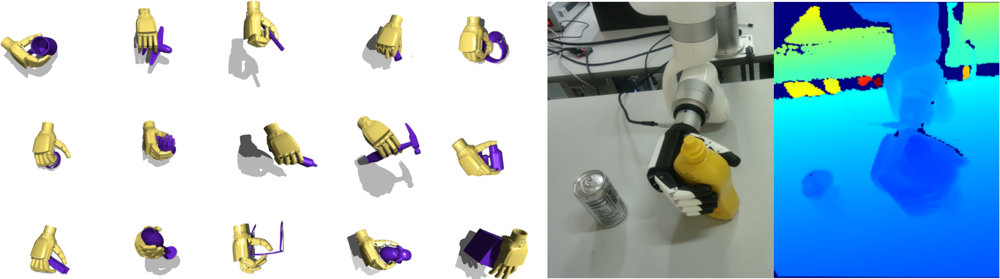

<p align="center">
<h1 align="center"><strong>[CoRL 2025] Dexplore: Scalable Neural Control for Dexterous Manipulation from Reference-Scoped Exploration</strong></h1>
  <p align="center">
    <a href='https://sirui-xu.github.io/' target='_blank'>Sirui Xu</a><sup>1,2</sup>&emsp;
    <a href='https://research.nvidia.com/person/yu-wei-chao' target='_blank'>Yu-Wei Chao</a><sup>2</sup>&emsp;
    <a href='https://scholar.google.com/citations?user=J2z-0lgAAAAJ' target='_blank'>Liuyu Bian</a><sup>2</sup>&emsp;
    <a href='https://scholar.google.com/citations?user=fcA9m88AAAAJ' target='_blank'>Arsalan Mousavian</a><sup>2</sup>&emsp;
    <a href='https://yxw.web.illinois.edu/' target='_blank'>Yu-Xiong Wang</a><sup>1</sup>&emsp;
    <a href='https://lgui.web.illinois.edu/' target='_blank'>Liang-Yan Gui</a><sup>1</sup>&emsp;
    <a href='https://wyang.me/' target='_blank'>Wei Yang</a><sup>2</sup>&emsp;
    <br>
    <sup>1</sup>University of Illinois Urbana-Champaign&emsp;
    <sup>2</sup>NVIDIA
  </p>
</p>

<p align="center">
  <a href='https://arxiv.org/abs/2509.09671'>
    </a>
  <a href='https://arxiv.org/pdf/2509.09671.pdf'>
    </a>
  <a href='https://sirui-xu.github.io/dexplore/'>
    </a>
</p>


<p align="center">
  
</p>

> **Dexplore** is a **unified optimization framework** that combines **retargeting** and **tracking** into a single learning loop for **dexterous manipulation** — using human demonstrations as **soft guidance** with adaptive spatial scopes to train policies across **diverse robot hands**.

## Installation

### Prerequisites

- NVIDIA GPU with CUDA support
- [Isaac Gym Preview 4](https://developer.nvidia.com/isaac-gym) (requires NVIDIA developer account)

### Setup

This project shares the same environment setup as [InterMimic](https://github.com/Sirui-Xu/InterMimic). Follow their installation instructions, or use the steps below:

```bash
conda create -n dexplore python=3.8
conda activate dexplore
conda install pytorch torchvision torchaudio pytorch-cuda=11.6 -c pytorch -c nvidia

# Install Isaac Gym (follow NVIDIA's instructions)
cd isaacgym/python && pip install -e .

# Install pinned dependencies (rl-games version must be 1.1.4)
pip install -r requirement.txt

# Optional: for distillation (PointNet++ encoder)
pip install torch-geometric
```

### Robot hand assets

The robot hand URDFs and meshes shipped under [dexplore/data/assets/](dexplore/data/assets/) are derived from [dex-urdf](https://github.com/dexsuite/dex-urdf) with Dexplore-specific modifications: each hand has a 6-DOF floating-base wrist prepended (3 prismatic + 3 revolute joints), and the inspire hand is rebuilt from a SolidWorks export to match our lab hardware. Custom decimated collision meshes are added for sim performance. See [NOTICE](NOTICE) for upstream attribution and license aggregation.

## Data Preparation

The training data comes from the [GRAB](https://grab.is.tue.mpg.de/) dataset, which cannot be redistributed. You must download it yourself and run our conversion pipeline.

### Step 1: Download and Process Required Data

**GRAB dataset** — Register and download from [grab.is.tue.mpg.de](https://grab.is.tue.mpg.de/). Use [InterAct](https://github.com/wzyabcas/InterAct) to process the raw GRAB data — follow both the main processing pipeline and the [Data for Simulation](https://github.com/wzyabcas/InterAct#-data-for-simulation) section. Run the simulation step **for GRAB only** (`python interact2mimic.py --dataset_name grab`); the other datasets are not used here. This writes per-subject MuJoCo skeletons to `simulation/intermimic/data/assets/smplx/` named `smplx_grab_s{N}.xml`. You will also need the **SMPL-X body model** from [smpl-x.is.tue.mpg.de](https://smpl-x.is.tue.mpg.de/).

### Step 2: Organize Data

Extract the downloaded files into a single directory with the following structure:

```
grab_dir/
├── sequences/              # Processed sequences (from InterAct pipeline)
│   ├── s1_airplane_fly_1/
│   │   ├── motion.npz
│   │   └── object.npz
│   └── ...
├── objects/                # Object meshes (extracted from tools__object_meshes__contact_meshes.zip)
│   ├── cup/
│   │   ├── cup.ply
│   │   ├── sample_points.npy
│   │   └── ...
│   └── ...
├── tools/                  # Body templates (from GRAB download)
│   ├── male/               # Extracted from tools__subject_meshes__male.zip
│   │   ├── s1.ply
│   │   └── ...
│   └── female/             # Extracted from tools__subject_meshes__female.zip
│       └── ...
└── raw/                    # Raw per-subject data
    ├── s1/                 # Extracted from grab__s1.zip
    │   ├── airplane_fly_1.npz
    │   └── ...
    └── ...
```

> **Note:** After organizing the above, copy object meshes and the InterMimic-generated SMPL-X skeleton assets into the project:
> ```bash
> cp -r grab_dir/objects dexplore/data/assets/mjcf/
> cp -r /path/to/InterAct/simulation/intermimic/data/assets/smplx dexplore/data/assets/
> ```

### Step 3: Install Dependencies

```bash
pip install dex-retargeting sapien smplx
```

> **Note:** `dex-retargeting` and `sapien` require Python >= 3.9. If your training env uses Python 3.8 (required by isaacgym), create a separate env for data processing.

### Step 4: Run Conversion

```bash
python data_processing/convert_grab.py \
    --robot inspire \
    --grab_dir /path/to/grab_dir \
    --original_grab_dir /path/to/grab_dir/raw \
    --smplx_model_dir /path/to/smplx/models
```

Supported robots: `inspire`, `leap`, `allegro`, `shadow`.

## Quick Start

### Stage 1: Reference-Scoped Tracking (Teacher Policy)

Train a state-based teacher policy from human demonstrations:

```bash
# Replace {robot} with: inspire, leap, allegro, or shadow
python dexplore/run.py \
    --task Dexplore_{Robot} \
    --cfg_env dexplore/data/cfg/{robot}.yaml \
    --cfg_train dexplore/data/cfg/train/rlg/{robot}.yaml \
    --output checkpoint/ --headless
```

### Stage 2: Vision-Based Distillation (Student Policy)

Distill the teacher into a vision-based controller using DAgger with a PointNet++ encoder and VAE:

```bash
python dexplore/run.py \
    --task Dexplore_Distill --distill \
    --cfg_env dexplore/data/cfg/inspire_distill.yaml \
    --cfg_train dexplore/data/cfg/train/rlg/inspire_distill.yaml \
    --output checkpoint/ --headless
```


## Evaluation

### Stage 1: Teacher Policy Evaluation

Test a trained teacher checkpoint:

```bash
python dexplore/run.py \
    --task Dexplore_Inspire \
    --cfg_env dexplore/data/cfg/inspire.yaml \
    --cfg_train dexplore/data/cfg/train/rlg/inspire.yaml \
    --test --checkpoint checkpoint/inspire.pth \
    --num_envs 16
```

Compute success rate metrics:

```bash
python dexplore/evaluate.py \
    --task Dexplore_Inspire \
    --cfg_env dexplore/data/cfg/inspire.yaml \
    --cfg_train dexplore/data/cfg/train/rlg/inspire.yaml \
    --checkpoint checkpoint/inspire.pth \
    --headless --num_envs 64 --output eval_results.json
```

### Stage 2: Student Policy Evaluation

Visualize a distilled student checkpoint in the viewer (uses `eval_distill.py` without `--headless` since the distill checkpoint format requires its custom restore logic):

```bash
python dexplore/eval_distill.py \
    --task Dexplore_Distill --distill \
    --cfg_env dexplore/data/cfg/inspire_distill.yaml \
    --cfg_train dexplore/data/cfg/train/rlg/inspire_distill.yaml \
    --checkpoint checkpoint/inspire_distill/nn/latest.pth \
    --num_envs 4 --output eval_results_distill.json
```

Or use the convenience script:

```bash
./scripts/vis_distill.sh
```

Compute success rate metrics:

```bash
python dexplore/eval_distill.py \
    --task Dexplore_Distill --distill \
    --cfg_env dexplore/data/cfg/inspire_distill.yaml \
    --cfg_train dexplore/data/cfg/train/rlg/inspire_distill.yaml \
    --checkpoint checkpoint/inspire_distill/nn/latest.pth \
    --headless --num_envs 64 --output eval_results_distill.json
```

Or use the convenience script:

```bash
./scripts/eval_distill.sh
```


## Robot Hands

We provide a pretrained checkpoint for the [Inspire](https://www.interbotix.com/) hand (18 DOFs). The framework is designed to be robot-agnostic — adding a new hand requires only a URDF and a thin task subclass. We include example implementations for several hands as reference:

| Robot | DOFs | Task Class | Config |
|-------|------|-----------|--------|
| [Inspire](https://www.interbotix.com/) | 18 (6 wrist + 12 finger) | `Dexplore_Inspire` | `inspire.yaml` |
| [LEAP](https://leaphand.com/) | 22 (6 wrist + 16 finger) | `Dexplore_Leap` | `leap.yaml` |
| [Allegro](https://www.wonikrobotics.com/) | 22 (6 wrist + 16 finger) | `Dexplore_Allegro` | `allegro.yaml` |
| [Shadow](https://www.shadowrobot.com/) | 30 (6 wrist + 24 finger) | `Dexplore_Shadow` | `shadow.yaml` |

### Adding a new robot hand

1. Create a URDF in `dexplore/data/assets/`
2. Create a subclass in `dexplore/env/tasks/dexplore_<name>.py`:

```python
from env.tasks.base_dexplore_task import DexploreTask

class Dexplore_MyRobot(DexploreTask):
    # Example: 18 DOFs = 6 wrist + 12 finger
    DOF_VELOCITY = (7,) * 18
    DOF_STIFFNESS = (200,) * 6 + (100,) * 12
    DOF_DAMPING = (20,) * 6 + (10,) * 12

    def _get_robot_type(self):
        return "my_robot_hand/my_robot_hand_right.urdf"

    def _apply_collision_filter(self, env_ptr, humanoid_handle):
        ...  # set per-link collision filters

    def _action_to_pd_targets(self, action):
        ...  # map actions to PD targets (handle coupled joints)

    def _set_env_state(self, env_ids, dof_pos, dof_vel):
        ...  # reset joint states (handle coupled joints at reset)
```

3. Register in `dexplore/utils/parse_task.py`
4. Create config YAMLs in `dexplore/data/cfg/`


## Citation

```bibtex
@inproceedings{xu2025dexplore,
    title={Dexplore: Scalable Neural Control for Dexterous Manipulation from Reference-Scoped Exploration},
    author={Xu, Sirui and Chao, Yu-Wei and Bian, Liuyu and Mousavian, Arsalan and Wang, Yu-Xiong and Gui, Liang-Yan and Yang, Wei},
    booktitle={CoRL},
    year={2025}
}

@inproceedings{xu2025intermimic,
  title = {{InterMimic}: Towards Universal Whole-Body Control for Physics-Based Human-Object Interactions},
  author = {Xu, Sirui and Ling, Hung Yu and Wang, Yu-Xiong and Gui, Liang-Yan},
  booktitle = {CVPR},
  year = {2025},
}
```

If you use the data processing pipeline, please also cite:

```bibtex
@inproceedings{xu2025interact,
  title = {{InterAct}: Advancing Large-Scale Versatile 3D Human-Object Interaction Generation},
  author = {Xu, Sirui and Li, Dongting and Zhang, Yucheng and Xu, Xiyan and Long, Qi and Wang, Ziyin and Lu, Yunzhi and Dong, Shuchang and Jiang, Hezi and Gupta, Akshat and Wang, Yu-Xiong and Gui, Liang-Yan},
  booktitle = {CVPR},
  year = {2025},
}
```

## Acknowledgements

This codebase builds on [Isaac Gym](https://developer.nvidia.com/isaac-gym) and [rl_games](https://github.com/Denys88/rl_games). The core training algorithm is based on [InterMimic](https://github.com/Sirui-Xu/InterMimic). The data processing pipeline uses [InterAct](https://github.com/wzyabcas/InterAct) for GRAB data conversion, [dex-retargeting](https://github.com/dexsuite/dex-retargeting) for hand pose retargeting, and [dex-urdf](https://github.com/dexsuite/dex-urdf) for robot hand URDF models.

Note: The retargeting step in data processing is not strictly necessary for training -- we provide it as a convenient data preparation tool. Users can supply their own retargeted motion data in the expected format.
